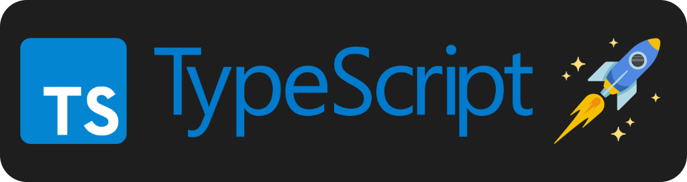

<p align="center">
  <a href="https://expressjs.com/" target="blank"></a>
</p>

<h1 align="center">⭐ Typescript Library Template ⭐</h1>

<p align="center">
  Template for new libraries based on Typescript with the Best Practices and Ready for Production
</p>

<p align="center">
  <a href="https://github.com/AlbertHernandez/typescript-library-template/actions/workflows/node.yml?branch=main"></a>
  <a href="https://nodejs.org"></a>
  <a href="https://nodejs.org/docs/latest-v20.x/api/index.html"></a>
  <a href="https://www.typescriptlang.org/"></a>
  <a href="https://vitest.dev/"></a>
  <a href="https://www.npmjs.com/package/typescript-library-template-example/v/latest"></a>
</p>

## 👀 Motivation

Starting a new library for NodeJS can be a bit frustrating, there are a lot of things to consider if we want to have a really good starting point where later we can iterate.

The main objective of this template is to provide a good base configuration for our NodeJS libraries that we can start using and move to production as soon as possible.

## 🌟 What is including this template?

1. 🐳 Fully dockerized project ready to develop in the library.
2. 👷 Use [SWC](https://swc.rs/) for running the tests of the library.
3. 🐶 Integration with [husky](https://typicode.github.io/husky/) to ensure we have good quality and conventions while we are developing like:
   - 💅 Running the linter over the files that have been changed
   - 💬 Use [conventional commits](https://www.conventionalcommits.org/en/v1.0.0/) to ensure our commits have a convention.
   - ✅ Run the tests automatically.
   - ⚙️ Check our library does not have type errors with Typescript.
   - 🙊 Check typos to ensure we don't have grammar mistakes.
4. 🧪 Testing with [Vitest](https://vitest.dev/)
5. 📌 Custom path aliases, where you can define your own paths (you will be able to use imports like `@src` instead of `../../../src`).
6. 🚀 CI/CD using GitHub Actions, helping ensure a good quality of our code and providing useful insights about dependencies, security vulnerabilities and others.
7. 🤖 ChatOps approach to help creating release candidates, getting help and more things. [Here](https://github.com/AlbertHernandez/typescript-library-template/pull/105#issuecomment-1963059727) is an example.
8. 🥷 Fully automatized release process. You just need to merge into `main` branch using conventional commits and that's all. Automatically we will:
   - 📘 Update library version
   - 📍 Create the tags associated to your change
   - 📝 Update the changelog
   - 📦 Create a release
   - ☁️ Publish the new version to NPM

## 🤩 Other templates

Are you thinking in start some new service in the NodeJS ecosystem? If you like this template there are others base on this you can check:

- [Template for new Typescript Express Services](https://github.com/AlbertHernandez/express-typescript-service-template)
- [Template for new NestJS Services](https://github.com/AlbertHernandez/nestjs-service-template)
- [Template for new GitHub Actions based on NodeJS](https://github.com/AlbertHernandez/github-action-nodejs-template)

## 🧑‍💻 Developing

The library is fully dockerized 🐳, if we want to start the app in **development mode**, we just need to run:

```bash
docker-compose up -d
```

This development mode with work with **hot-reload** and exposing a **debug port**, the `9229`, so later we can connect from our editor to it.

Now, you should be able to start debugging configuring using your IDE. For example, if you are using vscode, you can create a `.vscode/launch.json` file with the following config:

```json
{
  "version": "0.1.0",
  "configurations": [
    {
      "type": "node",
      "request": "attach",
      "name": "Attach to docker",
      "restart": true,
      "port": 9229,
      "remoteRoot": "/app"
    }
  ]
}
```

When you want to stop developing, you can stop the project running:

```bash
docker-compose down
```

## ⚙️ Building

```bash
npm run build
```

## ✅ Testing

If you want to run the tests of the project, you can execute the following command:

```bash
npm run test
```

## 💅 Linting

To run the linter you can execute:

```bash
npm run lint
```

And for trying to fix lint issues automatically, you can run:

```bash
npm run lint:fix
```
